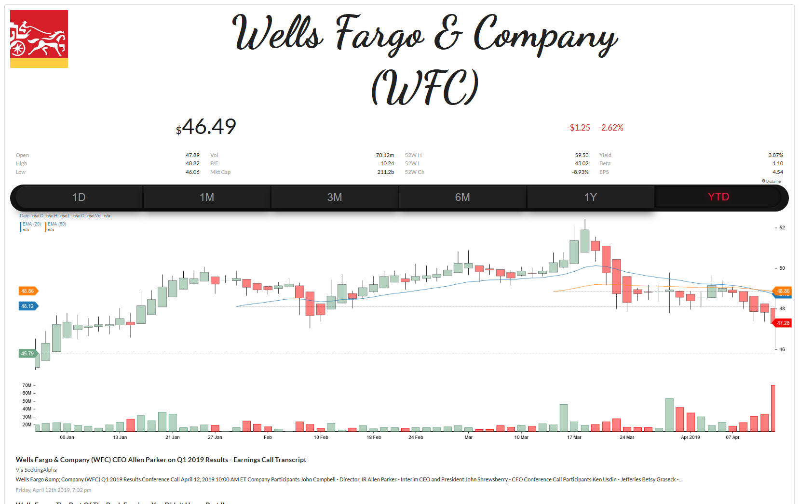
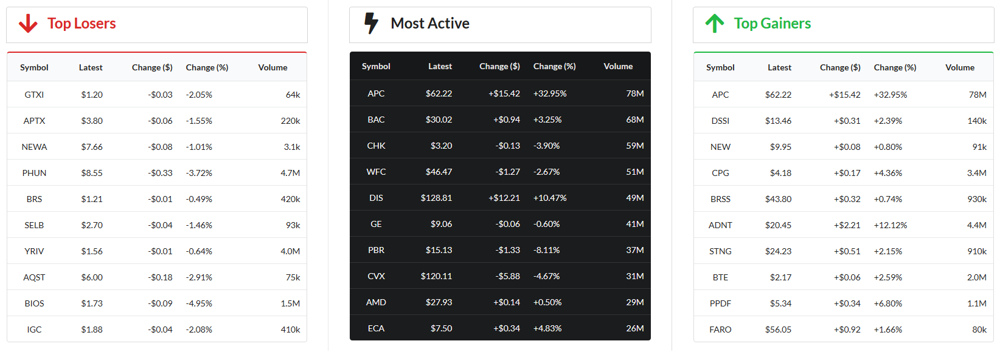
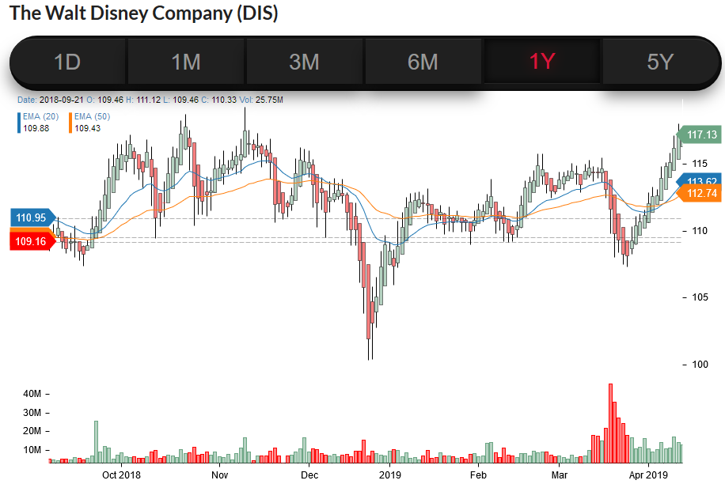

2019-may
---
Great things about this UI is that:
1) No page refresh (everything async)
2) algolia-instant-search component is pretty spiffy
3) a visually stunning configuration of react-stock-chart's heikin-ashi candle-stick-charts
    - lets not forget about a stylized candlestick rescued from vx/demo. 
4) It embraces skeumorphic design principles to render analog styled UI

## Visualization
---
On the visualization front:
1) d3's force-layout executed with react-hooks and context.
   - The force layout features self organizing clusters of stocks into sectors.
   - The individual bubbles are interactive and can be dragged around with mouse or touch.
2) Observable Notebooks that have been embedded into the app 
   - S&P500 Heatmap
   - Major Indexes in a Circle Pack

2019-april
---

- these are the building blocks to bigger ideas
- it's sorta messy but lots of things work here 

---
UPDATE: 2019-04-12

---

UPDATE: 2019-04-10

---

